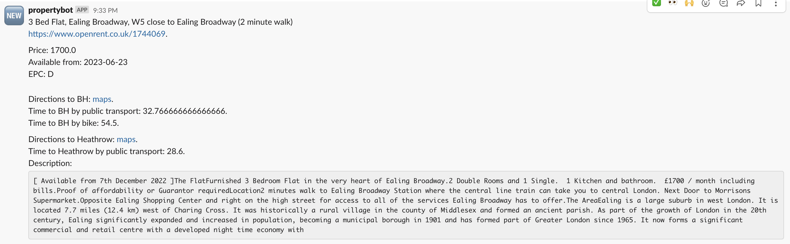

# Openrent slack notifier

This program parses property listings on openrent.co.uk and if a listing is new
and is suitable then it will issue a slack notification.

Be the first one to contact the landlord!

This repo is forked from https://github.com/afiodorov/openrent and has been adjusted to work with the current version of openrent. Google maps api functionality has been added.
# How it works

`./get_properties.py` gets the list of candidate properties then parses each and
notifies if the property is promising.

Links to parsed properties are stored in `links.json` whilst data about each property
is stored in text files in `properties/` folder.

For example:

```
{
    "id": "1744069",
    "title": "3 Bed Flat, Ealing Broadway, W5",
    "address": " Ealing Broadway, W5",
    "location": [
        [
            "Ealing Broadway",
            "2 minute walk"
        ],
        [
            "Ealing Broadway",
            "2 minute walk"
        ],
        [
            "Ealing Common",
            "15 minute walk"
        ],
        [
            "North Ealing",
            "16 minute walk"
        ]
    ],
    "price": 1700.0,
    "description": "[ Available from 7th December 2022 ]The FlatFurnished 3 Bedroom Flat in the very heart of Ealing Broadway.2 Double Rooms and 1 Single.  1 Kitchen and bathroom.  £1700 / month including bills.Proof of affordability or Guarantor requiredLocation2 minutes walk to Ealing Broadway Station where the central line train can take you to central London. Next Door to Morrisons Supermarket.Opposite Ealing Shopping Center and right on the high street for access to all of the services Ealing Broadway has to offer.The AreaEaling is a large suburb in west London. It is located 7.7 miles (12.4 km) west of Charing Cross. It was historically a rural village in the county of Middlesex and formed an ancient parish. As part of the growth of London in the 20th century, Ealing significantly expanded and increased in population, becoming a municipal borough in 1901 and has formed part of Greater London since 1965. It now forms a significant commercial and retail centre with a developed night time economy with Ealing Broadway acting as the heart of the area.For more information see this area guide:",
    "available_from": "2023-06-23",
    "EPC": "D",
    "has_garden": false,
    "duration_1_transit": 32,
    "duration_1_bike": 54,
    "duration_2_transit": 28
}

> head -n10 links.json

[
    "192135",
    "155303",
    "185305",
    "196322",
    "177777",
    "153587",
    "181113",
    "188911",
    "188648",
```

# Installation

I recommend creating a virtual environment with venv or conda.

`pip3 install -r requirements.txt`

Then add the folling to your crontab:

```
*/10 * * * * /usr/local/bin/python3 $HOME/openrent/get_properties.py
```

For mac, launchd is recommended now - here a tutorial
https://davidhamann.de/2018/03/13/setting-up-a-launchagent-macos-cron/

# Usage

Depending on what browser you are using, you will need to adjust 

`driver = webdriver.Firefox()` in `get_properties.py`

Create `config.json` as per example:

```
{
	"center_addr": "------",
	"work_addr1": "------",
	"work_addr2": "------",
	"slack_token": "xoxb-....",
	"maps_api_key": "------"
}
```

modify `should_notify` in `./get_properties.py` as appropriate. This function determines whether a slack notification should be created for a property.

Also you probably want to modify your search parameters too:

```
PRICE_MAX = 3000
PRICE_MIN = 0
KM_RANGE = 15
MAX_TRANSIT_DURATION_ADDR_1 = 40
MAX_TRANSIT_DURATION_ADDR_2 = 60
BEDROOMS_MIN = 3
BEDROOMS_MAX = 3
```

In my configuration I am looking at properties within 15 km's of `center_addr`
and the notification includes a link to directions to the `word_addr1`, `word_addr2`.
It uses the google maps directions api (there is a free monthly allowance)
Properties that are farther away than their respective MAX_TRANSIT_DURATION to addr1 or addr2 are filtered out.

# Example of a notification



# Development

`links.json` is an auxiliary file, however it's useful for trying out the new
logic for the notifications. Deleting a property from there will make
`./get_properties.py` script think that it's a new property but getting the
body of that property from openrent and parsing will be skipped.
